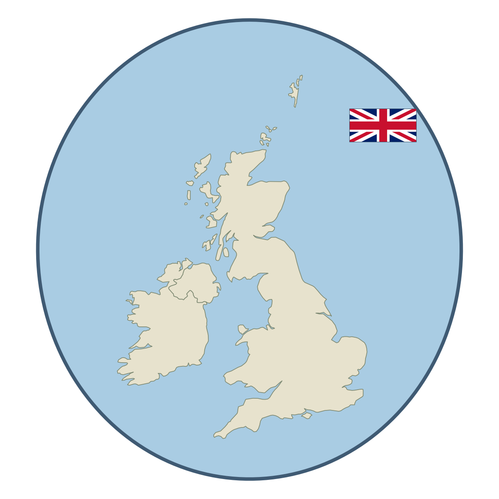

<p align="center">
  
</p>

<h1 align="center">UK Offshore Wind Pipeline</h1>

<p align="center">
  An open, reproducible Python pipeline for siting, energy-yield, and cost
  assessment of offshore wind across the UK Exclusive Economic Zone.
</p>

---

## What it does

Run `python main.py` and it works through five stages, writing maps, charts and
figures into `outputs/`:

1. Lay a grid over UK waters and attach wind speed, water depth, distance to the
   nearest port, and seabed type to every cell.
2. Drop the cells that cannot work (too shallow, too deep, inside a marine
   protected area), score what is left, and pick the 15 best sites while keeping
   them spread apart.
3. Turn ERA5 reanalysis wind into an hourly capacity factor and an annual energy
   figure for each site.
4. Cost each site with a depth-aware LCOE model.
5. Find the Dunkelflaute, the multi-day lulls when there is almost no wind, since
   those are what make a wind-heavy grid nervous.

To check the wind numbers, each of the 44 operational UK farms is run through
ERA5 with its own turbine and compared against its reported output.

## Data

Everything comes from open sources: ERA5 for wind, GEBCO for bathymetry, JNCC for
protected areas and the EEZ boundary, and BGS for seabed sediment. Without the
ERA5 file the pipeline falls back to a synthetic wind field, so it still runs
offline.

## Running it

```bash
pip install -r requirements.txt
python main.py
```

The knobs all live in `config.py`: study area, turbine, depth limits, scoring
weights, and the economic assumptions.

## Status

Early days, and the name may change. Site selection and capacity factors now run
on ERA5; the cost figures are still being checked against the operational fleet,
so treat the LCOE numbers as indicative for now.
